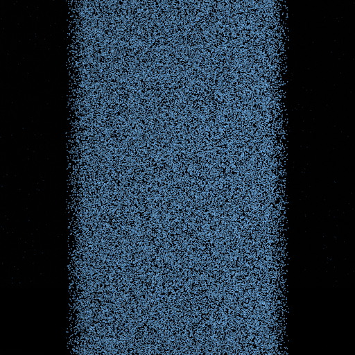

# AGMitsubaRendererAndOptimizer

AGMitsubaRendererAndOptimizer is a project that provides a framework to optimize rendering parameters in the Mitsuba renderer using various optimization techniques, such as Adam and CMA-ES. The goal is to minimize the difference between a reference (true) rendered image and an optimized scene image by adjusting key scene parameters.

## Table of Contents
- [Introduction](#introduction)
- [Features](#features)
- [Installation](#installation)
- [Usage](#usage)
  - [Adam Optimizer](#adam-optimizer)
  - [CMA-ES Optimizer](#cma-es-optimizer)
- [Project Structure](#project-structure)
- [Dependencies](#dependencies)
- [Contributing](#contributing)
- [License](#license)

## Introduction

The purpose of this project is to optimize scene parameters in the Mitsuba renderer for tasks such as inverse rendering. This tool allows users to find the best-fitting parameters by comparing a rendered image to a reference image and minimizing the loss through gradient-based (Adam) and evolutionary (CMA-ES) optimization techniques.

Here is a visual overview of how the system works:
## Features
- **Rendering with Mitsuba 3**: Uses the Mitsuba 3 renderer to compute high-quality images based on scene parameters.
- **Adam Optimizer**: A gradient-based optimizer with a finite difference approximation of gradients.
- **CMA-ES Optimizer**: A covariance matrix adaptation evolution strategy optimizer for robust parameter estimation.
- **WandB Integration**: Log runs and monitor optimization progress with [Weights and Biases](https://wandb.ai/).


## Installation

To get started with AGMitsubaRendererAndOptimizer, clone the repository and install the necessary dependencies.

```bash
git clone https://github.com/yourusername/AGMitsubaRendererAndOptimizer.git
cd AGMitsubaRendererAndOptimizer
pip install -r requirements.txt
```

## Download Pytorch

- From this webpage, get the desired command to download pytorch.

```bash
pip install torch torchvision torchaudio --index-url https://download.pytorch.org/whl/cu118
```


Ensure that [Mitsuba 3](https://mitsuba.readthedocs.io/) is properly installed and configured on your system.

## Usage

### Adam Optimizer

To run the Adam optimization, use the `optimize_with_adam.py` script. This script optimizes the specified scene parameters using the Adam optimization algorithm with finite differences.

```bash
python optimize_with_adam.py
```

The key parameters, such as learning rate, finite difference step size, and the number of iterations, are configured within the script. You can also change the scene and rendering configurations.

### CMA-ES Optimizer

To run the CMA-ES optimization, use the `optimize_with_cma-es.py` script. This script utilizes the evolutionary optimization algorithm CMA-ES to search for optimal parameters.

```bash
python optimize_with_cma-es.py
```

Again, parameters such as population size, the number of iterations, and the bounds of the search space are defined within the script.

## Project Structure

```
├── .gitignore
├── optimize_with_adam.py        # Script for Adam-based optimization
├── optimize_with_cma-es.py      # Script for CMA-ES-based optimization
├── requirements.txt             # Python dependencies
├── src/                         # Source code
│   ├── calc.py                  # Contains calculation functions like total variation and loss computation
│   ├── loader.py                # Handles loading true images and parameters
│   ├── optimizer.py             # Contains optimizer logic for Adam and CMA-ES
│   ├── render.py                # Functions to render scenes with Mitsuba
├── output/                      # Directory for storing optimization results
└── README.md
```

### Key Modules

- **optimizer.py**: Contains both Adam and CMA-ES optimization logic.
- **calc.py**: Implements functions for loss calculation, including total variation for regularization.
- **loader.py**: Loads reference (true) images and parameter values from disk.
- **render.py**: Handles the rendering of scenes with Mitsuba.

## Dependencies

The following dependencies are required to run the project. See `requirements.txt` for the complete list.

- [Mitsuba 3](https://mitsuba.readthedocs.io/)
- [NumPy](https://numpy.org/)
- [Torch](https://pytorch.org/)
- [Weights and Biases](https://wandb.ai/)
- [CMA-ES](https://github.com/CMA-ES/c-cmaes)


## Optimization Example

<p align="center">
  
  
  
</p>

<p align="center">
  <b>Initial Image</b> &emsp; &emsp; <b>Optimization Result</b> &emsp; &emsp; <b>Ground Truth</b>
</p>

